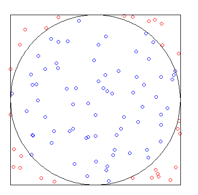

#### What is this?

Well, first of all, this is a shiny application. [Shiny](https://shiny.rstudio.com/) is an R package which makes it easy to build interactive web applications.

This application was built to celebrate $\pi$ day (March 14th). The purpose of this application is to show how two different simulations can be used to approximate $\pi$. There are two simulations we demonstrate: Buffon's needle and a Monte Carlo method. 

[Find the code for this app on GitHub!](https://github.com/bgstieber/PiSimulations)

#### Buffon's Needle

Buffon's needle is a fairly well known example from geometric probability. [Wikipedia](https://en.wikipedia.org/wiki/Buffon%27s_needle) has a nice explanation, as well as [Wolfram Mathworld](http://mathworld.wolfram.com/BuffonsNeedleProblem.html). Basically, we toss needles of some length (say $l$) onto a floor with equally spaced parallel lines drawn a distance (say $d$) apart. We then count how many needles cross a parallel line, and then we're ready to calculate $\pi$! 

The event that a needle crosses the line follows a [Bernoulli distribution](https://en.wikipedia.org/wiki/Bernoulli_distribution) with parameter $\theta = \frac{2 (l/d)}{\pi}$. By tossing multiple needles, we can use the proportion of times a line is crossed to estimate $\pi$, with our estimate being $\hat{\pi} = \frac{2n(l/d)}{N}$, where $n$ is the total number of tosses and $N$ is the number of line crossings. In our simulations, we set $l = d = 1$, so that our estimate is simply: $\hat{\pi} = \frac{2n}{N}$.

#### Monte Carlo

The Monte Carlo method is much simpler than Buffon's needle, and a nice explanation can be found [here](http://www.eveandersson.com/pi/monte-carlo-circle). Essentially, we have a circle inscribed within a square. The ratio of the area of this circle to the area of the square is $\pi/4$. So if $N$ points are picked at random within the square, approximately $\frac{N*\pi}{4}$ points will fall within the circle. Essentially, we have an event that follows a Bernoulli distribution with parameter $\theta = \pi/4$. 

Our estimate for $\pi$ is then $\hat{\pi} = \frac{4M}{N}$, where $M$ is the number of points falling within the circle. 

$$M = \frac{N*\pi}{4} \rightarrow 4M = N* \pi \rightarrow \hat{\pi} = \frac{4M}{N}$$

This method relies on drawing two points $(x, y)$ from the standard uniform distribution. All we have to do is calculate the proportion of points that fall within the unit quarter circle (you could use the whole circle or a half circle, but a quarter circle is easier to code), this can be accomplished by checking if $\sqrt{x^2 + y^2}\leq 1$. We then multiply this proportion by 4 to arrive at an approximation of $\pi$. 

The next two tabs contain visualizations of these two simulation methods. Play around with the number of simulations and observe how the approximation improves or degrades. 
